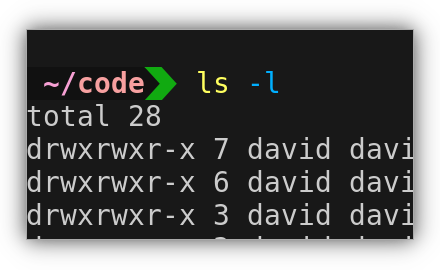
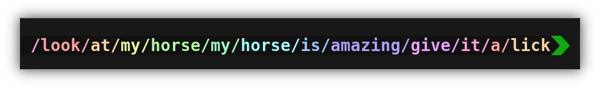
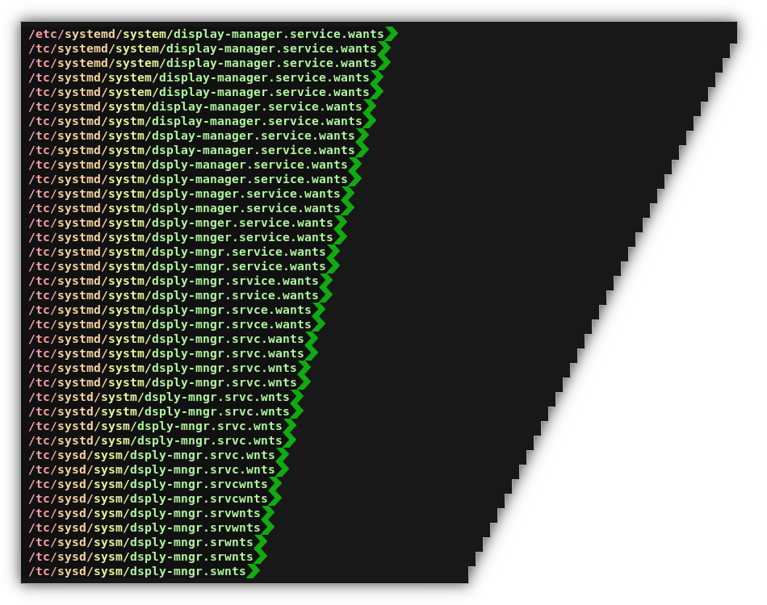
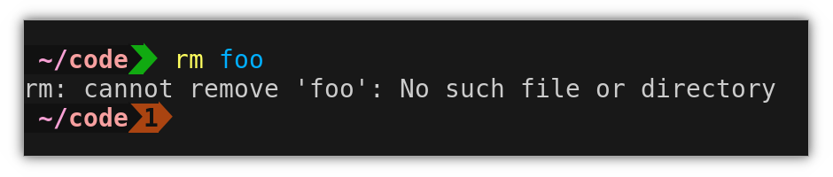
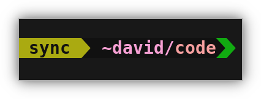
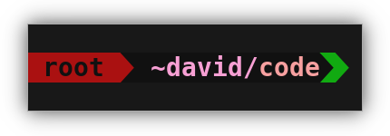
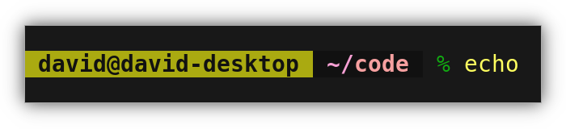

# 

 

A minimal yet aesthetic prompt for your shell.

Only Linux is supported at the moment.

## Features

### Simple and uncluttered

No git integration, no fancy icons, no date or time.

### Color-coded path for quick scanning

### Smart shortening for long paths

Based on vowels + word hollowing. Tries to use up to half of the available space.

### Shows just the status code of the last command

### Shows the username for non-main users

### Basic prompt when over SSH, where the powerline font may not be available

Also, the hostname is displayed, so you know where you are.

## Installation

### For the `bash` shell (What you probably have)

1. Install a powerline font
   - on Debian/Ubuntu you can do this with `sudo apt install fonts-powerline`
2. Download the latest release
   - `wget https://github.com/Wazzaps/focused_prompt/releases/latest/download/focused_prompt-$(uname -m)-linux`
3. Move the file to `/usr/local/bin/`:
   - `sudo mv focused_prompt-$(uname -m)-linux /usr/local/bin/focused_prompt`
   - `sudo chmod +x /usr/local/bin/focused_prompt`
4. Add the following at the end of your `~/.bashrc`:
   - `PROMPT_COMMAND='PS1="$(FP_STATUS=$? FP_MAIN_USER=YOUR_USERNAME_HERE FP_COLS=$COLUMNS /usr/local/bin/focused_prompt)"'`
     - Make sure to put in your username instead of `YOUR_USERNAME_HERE`
5. Restart your shell.

### For the `fish` shell

1. Install a powerline font
   - on Debian/Ubuntu you can do this with `sudo apt install fonts-powerline`
2. Download the latest release
   - `wget https://github.com/Wazzaps/focused_prompt/releases/latest/download/focused_prompt-(uname -m)-linux`
3. Run the installer
   - `chmod +x focused_prompt-* && sudo SHELL=fish ./focused_prompt-* install`
4. Press enter a couple of times

### For the `zsh` shell

1. You guys know what you're doing, have fun

## Uninstallation

### For the `bash` shell

1. Remove the line you added to your `~/.bashrc` in the installation instructions
2. `sudo rm /usr/local/bin/focused_prompt`
3. Run `PROMPT_COMMAND=''` in each shell you don't want to restart

### For the `fish` shell

1. `sudo rm /usr/local/bin/focused_prompt /etc/fish/functions/fish_prompt.fish`
2. Press enter a couple of times

### For the `zsh` shell

1. You guys know what you're doing, have fun
